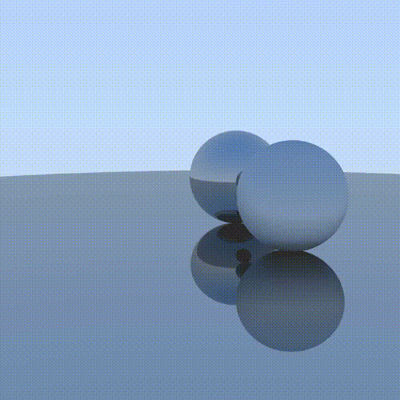

This is an another ray-tracing graphics engine written in Rust.

Features:

* All the computations are done on GPU via compute shader
* Asynchronous task distribution
* Rendering implicit (spheres) and explicit (meshes, Möller–Trumbore algorithm) figures
* Very simple animations
* Multisampling

Under heavy development.